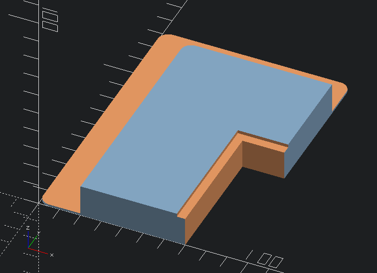

## Solder-paste-stencil jig for two-sided PCBs

A short OpenSCAD script to generate a simple 3D-printed jig to hold a two-sided
PCB while solder paste is applied with a stencil.

Customise the variables below and print two jigs, to hold opposite corners of
the board. Align against the PCB and tape to the bench.  Tape the stencil to
the platform, apply the solder paste, and repeat as required.

The jig raises the PCB off the bench enough to allow components on the
underside of the board to sit clear.
